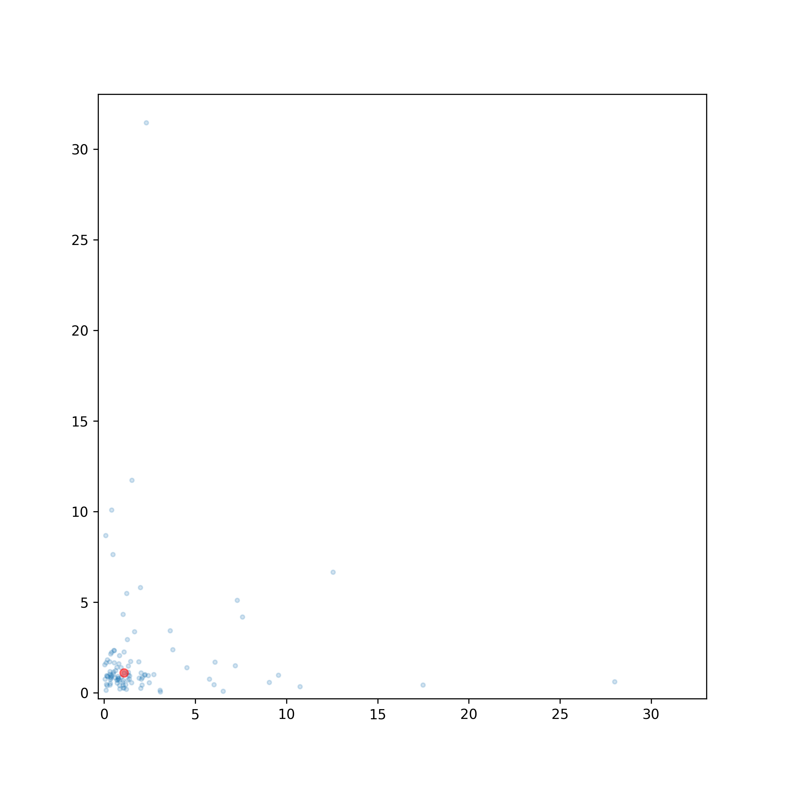

# Planet Distribution Simulation

This repository contains a simulation program that models the distribution of planets in a multi-dimensional space.

## Usage

### Installation

To use the simulation, make sure you have Python 3.x installed, and then install the required dependencies using the following command:

```bash
pip install -r requirements.txt
```

### Running the Simulation

To run the simulation, execute the following command:

```bash
python3 main.py
```

The simulation parameters can be adjusted using command-line arguments. Here are the available arguments:

```bash
python3 main.py --folder <folder_name> --filename <filename_prefix> --dimensions <num_dimensions> --planets <num_planets> --terminal-planets <num_terminal_planets> --iterations <num_iterations> --replace-folder
```

* `--folder`: Folder where simulation images will be saved. Default is "result".
* `--filename`: Prefix for the filenames of the simulation images. Default is "simulation".
* `--dimensions`: Number of dimensions for the simulation space. Default is 3.
* `--planets`: Total number of planets in the simulation. Default is 50.
* `--terminal-planets`: Number of terminal planets in the simulation. Default is 3.
* `--iterations`: Number of simulation iterations to run. Default is 1.
* `--replace-folder`: Flag to replace the folder if it already exists.

### Results

<table>
  <tr>
    <td></td>
    <td></td>
    <td></td>
  </tr>
  <tr>
    <td></td>
    <td></td>
    <td></td>
  </tr>
</table>

---

© 2023 William Justin
